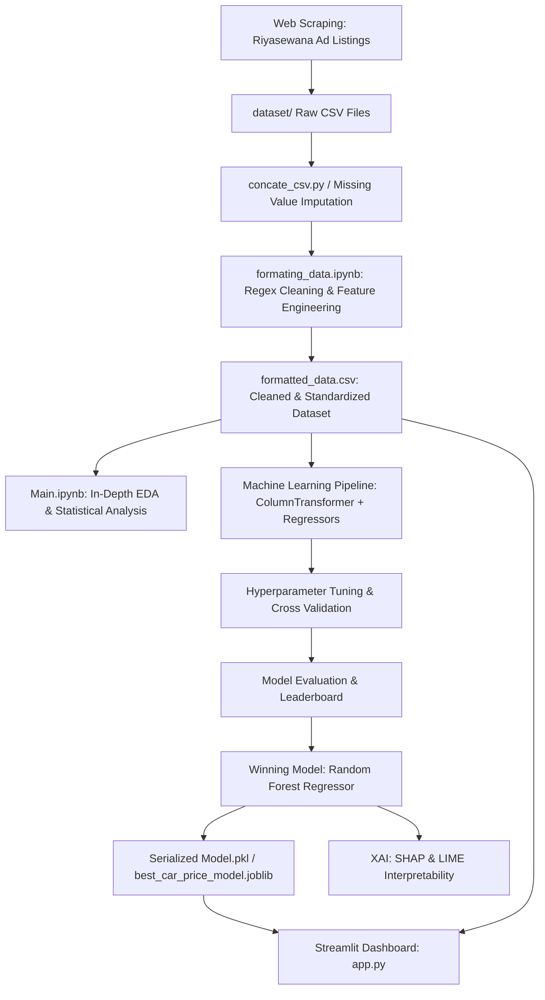

# 🚗 Sri Lanka Car Market Analysis & Price Prediction (2026)

[](https://www.python.org/)
[](https://streamlit.io/)
[](https://scikit-learn.org/)
[](https://xgboost.ai/)
[](https://shap.readthedocs.io/)
[](LICENSE)

An end-to-end Data Science and Machine Learning project that scrapes, cleans, analyzes, and models the Sri Lankan second-hand and brand-new car market. The repository includes an extensive exploratory analysis of vehicle pricing factors, comparative machine learning benchmarking, model explainability (SHAP & LIME), and an interactive **Streamlit** dashboard for real-time market value estimation.

---

## 📌 Table of Contents

- [Overview](#-overview)
- [Key Features](#-key-features)
- [Project Architecture](#-project-architecture)
- [Dataset Overview](#-dataset-overview)
- [Exploratory Data Analysis (EDA)](#-exploratory-data-analysis-eda)
- [Machine Learning Benchmarks](#-machine-learning-benchmarks)
- [Explainable AI (XAI) with SHAP & LIME](#-explainable-ai-xai-with-shap--lime)
- [Interactive Streamlit Web App](#-interactive-streamlit-web-app)
- [Directory Structure](#-directory-structure)
- [Installation & Setup](#-installation--setup)
- [Usage Guide](#-usage-guide)
- [Technologies & Libraries](#-technologies--libraries)
- [Roadmap & Future Improvements](#-roadmap--future-improvements)
- [License & Acknowledgements](#-license--acknowledgements)

---

## 📖 Overview

The automotive market in Sri Lanka exhibits unique pricing dynamics driven by import policies, currency fluctuations, vehicle condition, brand loyalty (notably Japanese manufacturers like Toyota, Honda, Suzuki, and Nissan), and option configurations. 

This project solves the challenge of vehicle valuation by:
1. **Automating Data Acquisition**: Scraping thousands of real-world listings from leading Sri Lankan automotive classified platforms (e.g., Riyasewana).
2. **Data Standardization & Feature Engineering**: Converting irregular text fields, parsing engine sizes, extracting features (Power Steering, Shutters, Mirrors), cleaning model nomenclature, and handling missing mileage values.
3. **Statistical & Exploratory Analysis**: Evaluating how mileage, manufacturing year (YOM), engine capacity (cc), body type, fuel type, and transmission affect resale prices.
4. **Predictive Modeling**: Benchmarking 8+ regression algorithms on log-transformed prices (`log1p(Price)`), hyperparameter tuning via GridSearchCV.
5. **Model Interpretability (XAI)**: Unraveling "black-box" decision boundaries using SHAP beeswarm/waterfall plots and LIME local/global feature weights.
6. **Production Deployment**: Providing an interactive Streamlit web dashboard for vehicle valuation and live exploratory market analytics.

---

## ✨ Key Features

- 🕷️ **Custom Web Scraper**: Robust scraper with polite delay mechanisms, pagination traversal, retry logic, and dynamic regex field extraction.
- 🧹 **Comprehensive Preprocessing Pipeline**: Automated multi-dataset concatenation, handling of 'Brand New' 0-km cases, currency parsing, text stripping, date normalization, and categorical encoding with `ColumnTransformer`.
- 📊 **30+ High-Resolution Visualizations**: Covering distribution curves, correlation heatmaps, boxplots by brand/fuel type, and time-series trends.
- 🤖 **Multi-Model Regression Suite**: Benchmarked **Random Forest**, **XGBoost Regressor**, **Support Vector Regression (SVR)**, **Decision Tree**, **Ridge**, **Lasso**, **SGD**, and **Linear Regression**.
- 💡 **Explainable AI (XAI)**:
  - **SHAP (SHapley Additive exPlanations)**: Beeswarm plots, global importance bars, and individual waterfall attributions.
  - **LIME (Local Interpretable Model-agnostic Explanations)**: Local perturbation analysis and aggregated feature weights.
- 🎛️ **Dual-Tab Streamlit Web Application**:
  - **Tab 1: Price Estimator**: Select brand, model, YOM, mileage, engine capacity, gear, fuel, condition, and options to predict market value in LKR.
  - **Tab 2: Interactive EDA Explorer**: Real-time multi-filter dashboard for market listing distributions, boxplots, scatter plots, and summary metrics.

---

## 🏗️ Project Architecture



---

## 📂 Dataset Overview

The dataset contains **6,400+ vehicle listings** across 30+ major vehicle makes and models in Sri Lanka, covering both popular everyday cars (Toyota Aqua, Premio, Allion, Corolla, Vitz, Axio, Yaris; Suzuki Wagon R, Alto, Swift, Every; Honda Vezel, Fit, Grace, Civic, CR-V; Nissan Sunny, Clipper) and premium segments (Mercedes-Benz, BMW, Audi, Volvo, Jaguar).

### Key Features

| Feature | Type | Description |
| :--- | :--- | :--- |
| `Brand` | Categorical | Manufacturer (Toyota, Honda, Suzuki, Nissan, Mercedes-Benz, BMW, etc.) |
| `Model_cleaned` | Categorical | Cleaned & standardized vehicle model string (e.g., `wagonr`, `aqua`, `premio`) |
| `YOM` | Numerical | Year of Manufacture |
| `Car_Age` | Numerical | Calculated vehicle age (`Current Year - YOM`) |
| `Mileage_numeric` | Numerical | Odometer reading in kilometers (imputed as 0 for Brand New) |
| `Engine (cc)` | Numerical | Engine displacement in cubic centimeters |
| `Number of Cylinders`| Numerical | Engine cylinder count |
| `Gear` | Categorical | Transmission type (`Automatic`, `Manual`, `Tiptronic`, `CVT`) |
| `Fuel Type` | Categorical | `Petrol`, `Diesel`, `Hybrid`, `Electric` |
| `Condition` | Categorical | `Registered (Used)`, `Unregistered`, `Brand New` |
| `Body Type` | Categorical | `Sedan`, `Hatchback`, `SUV / Crossover`, `Station Wagon`, `MPV`, etc. |
| `Power Steering` | Binary (0/1) | Presence of power steering |
| `Power Shutters` | Binary (0/1) | Presence of power windows/shutters |
| `Power Mirrors` | Binary (0/1) | Presence of power/retractable mirrors |
| `Price_numeric` | Target ($y$) | Listed vehicle price in Sri Lankan Rupees (LKR) |

---

## 📈 Exploratory Data Analysis (EDA)

Key market insights discovered during exploratory data analysis (saved in `fig/`):

- **Price vs. Car Age**: Exponential price depreciation in early years transitioning into relative price stabilization for Japanese reliability anchors.
- **Brand Premium & Resale Value**: Toyota and Suzuki dominate listing volume and retain highest percentage resale values relative to initial import costs.
- **Transmission & Options**: Automatic and Tiptronic transmissions command a significant premium over manual variants in urban centers.
- **Powertrain Dynamics**: Hybrid and electric vehicles display distinctive pricing curves driven by fuel efficiency demands in the Sri Lankan economic landscape.

| Visual Category | Sample Plots Generated |
| :--- | :--- |
| **Market Distributions** | `Price Distribution.png`, `Mileage Distribution.png`, `Engine SIze(cc) Distribution.png` |
| **Bivariate Relations** | `Year of Manufacture vs Price.png`, `Mileage vs Price.png`, `Engine Capacity vs Price.png` |
| **Categorical Segmentations** | `Price Distribution by Brand.png`, `Price Distribution by Fuel Type.png`, `Median car price by Body Type.png` |
| **Model Rankings** | `Median Price of Top 20 Car Models.png`, `Median Car Price by Location.png` |

---

## 🧪 Machine Learning Benchmarks

Models were evaluated on a held-out test split using **log-transformed target prices** ($\ln(1 + \text{Price})$) to handle right-skewed pricing distributions and ensure balanced residual variance across budget and luxury tiers.

### Test Set Performance Leaderboard

| Rank | Model | Regression Accuracy | MAE (Log) | MSE (Log) | RMSE (Log) | $R^2$ Score |
| :---: | :--- | :---: | :---: | :---: | :---: | :---: |
| 🥇 | **Random Forest Regressor** | **99.51%** | **0.0761** | **0.0202** | **0.1420** | **0.9478** |
| 🥈 | **XGBoost Regressor** | **99.45%** | **0.0852** | **0.0209** | **0.1447** | **0.9459** |
| 🥉 | **Support Vector Regressor (SVR)**| **99.51%** | **0.0760** | **0.0213** | **0.1460** | **0.9448** |
| 4 | **Linear Regression** | 99.39% | 0.0955 | 0.0248 | 0.1574 | 0.9359 |
| 5 | **Ridge Regression** | 99.38% | 0.0972 | 0.0251 | 0.1586 | 0.9350 |
| 6 | **Lasso Regression** | 99.36% | 0.1007 | 0.0262 | 0.1618 | 0.9323 |
| 7 | **SGD Regressor** | 99.31% | 0.1075 | 0.0303 | 0.1740 | 0.9217 |
| 8 | **Decision Tree Regressor** | 99.37% | 0.0993 | 0.0316 | 0.1779 | 0.9182 |

> **Best Model Selected**: `RandomForestRegressor` configured with `n_estimators=400`, `max_depth=25`, `min_samples_leaf=2`, `max_features=0.5`, achieving **$R^2 = 0.948$** and minimal prediction error.

---

## 🔍 Explainable AI (XAI) with SHAP & LIME

To ensure model transparency and understand valuation drivers, both global and local interpretability techniques were implemented:

### 1. SHAP (SHapley Additive exPlanations)
- **Global Feature Importance**: Demonstrates that `Car_Age` (YOM) and `Engine (cc)` are the dominant global drivers of vehicle valuation, followed by brand tiers and model classifications.
- **Beeswarm Plot (`fig/shap_beeswarm.png`)**: Highlights that lower vehicle age and higher engine capacity exert strong positive SHAP forces on price.
- **Waterfall Plot (`fig/shap_waterfall_example.png`)**: Visualizes exact additive contributions of each feature for single-car listing predictions.

### 2. LIME (Local Interpretable Model-agnostic Explanations)
- **Local Explanations (`fig/lime_local_example.png`)**: Creates sparse linear surrogate approximations around individual listings to explain why a specific vehicle was valued above or below market median.
- **Aggregated Importance (`fig/lime_aggregated_importance.png`)**: Synthesizes localized feature influence across samples.

---

## 🖥️ Interactive Streamlit Web App

The application (`app.py`) provides an intuitive, web-based interface for buyers, sellers, and automotive analysts.

```bash
streamlit run app.py
```

### Features:
1. **💰 Price Prediction**:
   - Dynamic model cascading (models update automatically based on selected brand).
   - Real-time conversion from logarithmic model outputs back to Sri Lankan Rupees (`LKR`).
   - Feature toggles for Power Steering, Shutters, and Mirrors.
2. **📊 Exploratory Data Analysis**:
   - Dynamic sidebar filters (filter by Brand and Condition).
   - High-level KPIs: Active listing counts, median price, median mileage, and median car age.
   - Interactive Seaborn & Matplotlib visualizations (histograms, boxplots, scatter plots, correlation matrices).
   - Expandable raw data table viewer.

---

## 📁 Directory Structure

```text
Sri-Lanka-Car-Market-Anlaysis-2026/
├── dataset/                               # Raw scraped CSV files per brand/model
│   ├── riyasewana_toyota_premio_with_country.csv
│   ├── riyasewana_suzuki_wagon_r_with_country.csv
│   ├── riyasewana_honda_vezel_edited.csv
│   └── ... (30+ brand/model CSVs)
├── fig/                                   # High-res analytical & XAI visualizations
│   ├── shap_beeswarm.png                  # SHAP global summary beeswarm
│   ├── shap_waterfall_example.png         # SHAP individual prediction waterfall
│   ├── lime_local_example.png             # LIME instance explanation
│   ├── price_by_brand.png                 # Price distribution across brands
│   ├── yom_vs_price.png                   # Year of Manufacture vs. Price
│   └── ... (30 saved visualization figures)
├── Main.ipynb                             # Primary EDA, Model Training, Benchmarking & XAI
├── formating_data.ipynb                   # Regex cleaning, string parsing & data pipeline
├── claude.ipynb                           # Auxiliary analytical exploration
├── scarpe_data.py                         # Beautiful Soup web scraper for Riyasewana
├── concate_csv.py                         # Script to merge all dataset/*.csv into a master file
├── fill_missing_mileage_brand_new_model.py# Imputation script for brand-new vehicle mileage
├── formatted_data.csv                     # Cleaned, standardized master dataset
├── combined_datasets.csv                  # Merged raw dataset
├── unique_models.txt                      # Extracted unique vehicle model mappings
├── Model.pkl                              # Serialized trained Random Forest pipeline
├── best_car_price_model.joblib            # Joblib serialized export of champion model
├── app.py                                 # Streamlit Web Application
└── README.md                              # Project documentation
```

---

## ⚙️ Installation & Setup

### 1. Clone the Repository
```bash
git clone https://github.com/savindu777/Sri-Lanka-Car-Market-Anlaysis-2026.git
cd Sri-Lanka-Car-Market-Anlaysis-2026
```

### 2. Create and Activate a Virtual Environment
```bash
# Windows (Command Prompt / PowerShell)
python -m venv venv
venv\Scripts\activate

# macOS / Linux
python3 -m venv venv
source venv/bin/activate
```

### 3. Install Dependencies
```bash
pip install pandas numpy scikit-learn xgboost matplotlib seaborn streamlit joblib requests beautifulsoup4 shap lime
```

---

## 🚀 Usage Guide

### 1. Run the Web Application
Launch the interactive Streamlit user interface:
```bash
streamlit run app.py
```
Open your browser at `http://localhost:8501`.

### 2. Run the Web Scraper (Optional)
To scrape fresh listings from Riyasewana:
```bash
python scarpe_data.py
```
*(Customize `SEARCH_URL` and `OUTPUT_CSV` in `scarpe_data.py` as needed).*

### 3. Data Processing & Concatenation
To concatenate separate model datasets and clean features:
```bash
python concate_csv.py
```
Open `formating_data.ipynb` in Jupyter Notebook/Lab to execute the preprocessing steps.

### 4. Model Training & Evaluation
Open `Main.ipynb` to re-train the models, execute hyperparameter grid searches, generate performance tables, and produce SHAP/LIME charts.

---

## 🛠️ Technologies & Libraries

- **Language**: Python 3.10+
- **Data Scraping**: `BeautifulSoup4`, `Requests`, `urllib`
- **Data Wrangling & Manipulation**: `Pandas`, `NumPy`, `Regex`
- **Visualization**: `Matplotlib`, `Seaborn`
- **Machine Learning**: `Scikit-Learn`, `XGBoost`
- **Model Explainability (XAI)**: `SHAP`, `LIME`
- **Model Serialization**: `Joblib`, `Pickle`
- **Web App / UI**: `Streamlit`

---

## 🗺️ Roadmap & Future Improvements

- [ ] **Time-Series Depreciation Modeling**: Introduce inflation-adjusted macroeconomic variables (USD/LKR exchange rate, import tax brackets).
- [ ] **REST API Endpoint**: Deploy a FastAPI / Flask microservice for programmatic valuation queries.
- [ ] **Deep Learning Regressors**: Experiment with TabNet and Multi-Layer Perceptrons for tabular representation learning.
- [ ] **Image Multi-Modal Valuation**: Integrate vehicle exterior photos using Convolutional Neural Networks (CNNs) to score cosmetic condition.

---

## 📄 License

This project is licensed under the [MIT License](LICENSE) — feel free to use and modify it for personal, academic, or commercial research.

---

## 👤 Author

**Savindu**  
GitHub: [@savindu777](https://github.com/savindu777)  
Project Repository: [Sri-Lanka-Car-Market-Anlaysis-2026](https://github.com/savindu777/Sri-Lanka-Car-Market-Anlaysis-2026)